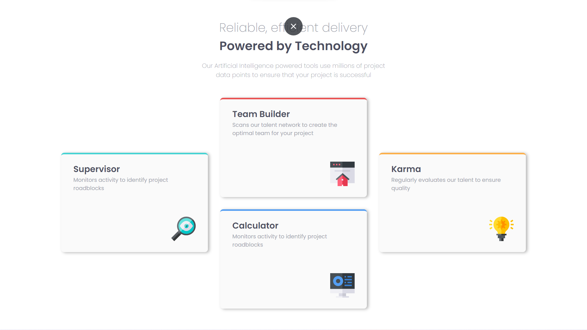
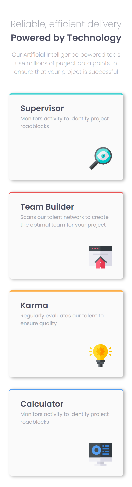

# Four-Card-Feature-Section

# Frontend Mentor - Four card feature section solution

This is a solution to the [Four card feature section challenge on Frontend Mentor](https://www.frontendmentor.io/challenges/four-card-feature-section-weK1eFYK). Frontend Mentor challenges help you improve your coding skills by building realistic projects. 

## Table of contents

- [Overview](#overview)
  - [The challenge](#the-challenge)
  - [Screenshot](#screenshot)
  - [Links](#links)
- [My process](#my-process)
  - [Built with](#built-with)
  - [What I learned](#what-i-learned)
  - [Continued development](#continued-development)
  - [Useful resources](#useful-resources)
- [Author](#author)

## Overview

### The challenge

Users should be able to:

- View the optimal layout for the site depending on their device's screen size

### Screenshot




### Links

- Solution URL: [Github Code Link](https://github.com/AmanGupta1703/Four-Card-Feature-Section/edit/main/README.md)
- Live Site URL: [Four Card Feature Section](https://amangupta1703.github.io/Four-Card-Feature-Section/)

## My process

### Built with

- Semantic HTML5 markup
- CSS custom properties
- Flexbox

### What I learned

```css

/* FEATURE CARD TEXT CONTENT */
.feature-card-text-content {
    display: flex;
    flex-direction: column;
    align-items: center;
    margin: 3rem 0 0;
}

.big-heading {
    color: var(--grayish-blue);
    font-size: 2rem;
}

.small-heading {
    color: var(--dark-blue);
    font-size: 2rem;
}

.card-description {
    color: var(--grayish-blue);
    text-align: center;
    width: 30rem;
    padding: 1rem 0 0;
}

/* FEATURE CARD BANNER */
.feature-card-banner {
    display: flex;
    justify-content: center;
    gap: 2rem;
    flex-wrap: wrap;
    margin: 3rem 0 0;
}

.banner-box {
    background-color: var(--light-gray);
    box-shadow: 4px 2px 8px var(--bs-cls);
    border-radius: 8px;
    padding: 1.4rem 2rem;
}

.supervisor-box, .karma-box {
    transform: translateY(9rem);
}

.banner-heading {
    font-size: 1.4rem;
    color: var(--dark-blue);
}

.banner-description {
    color: var(--grayish-blue);
    font-size: .9rem;
    width: 20rem;
    line-height: 1.5;
}

.banner-img {
    padding: 4rem 0 0;
    position: relative;
    left: 16rem;
}olor: papayawhip;

```
### Continued development

1) FlexBox 
2) Tranform Property

### Useful resources

- [W3School => Flex-Wrap](https://www.w3schools.com/cssref/css3_pr_flex-wrap.asp)
- [W3School => Transform](https://www.w3schools.com/cssref/css3_pr_transform.asp)

## Author

- Website - [Four Card Feature Section](https://amangupta1703.github.io/Four-Card-Feature-Section/)
- Frontend Mentor - [@AmanGupta1703](https://www.frontendmentor.io/profile/AmanGupta1703)
